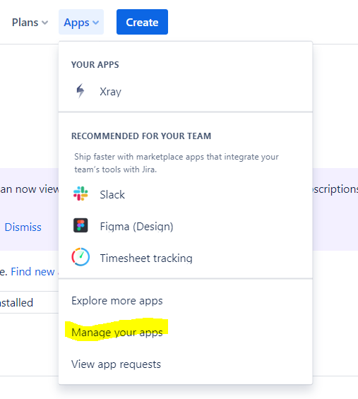
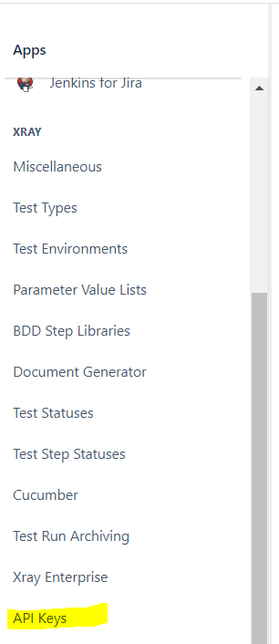
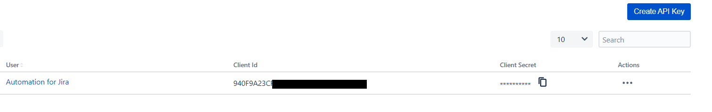
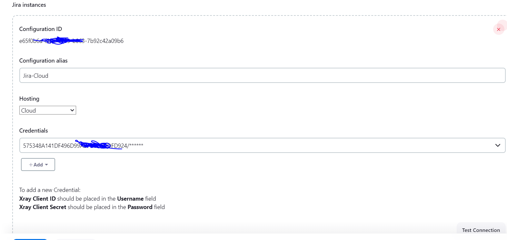

# Python-pytest-jenkins-automation-Xray-report

In this project in have created a jenkins-pipeline. In this pipeline a pytest ist executed in addition    
an allure Report is created, after the execution the Results will be reported to Xray.
<b>Note</b>

## GitHub
1. Create a GitHub-Repository with a basic pytest program.<b>
<br>NOTE : </b>Private Repos need authentication from Jenkins side.

## Xray

2. Generate the api-key in xray, this key is needed on jenkins side to verify the connection. 

2.1 Go to manage you apps in xray.



2.2 Click the api-key section



2.3 Create the key and the secret for the correct user (needed for jenkins setup)



This video is a good guideline how to set up you client-id and you secret in xray.
https://www.youtube.com/watch?v=0jK1rynnkQU&t=1161s

## Jenkins
3. Download the xray-management plugin on you jenkins instance.
4. Make the system settings on jenkins and test the connection ( example see below )




5. Create a Jenkins-Job (Pipeline Job) <br>

5.1 Add a Pipeline-Script :<br>You can create a Pipeline-Script in Jenkins or you can choose Pipeline-Script from SCM
( in ths case a jenkins file need to be present in your Git-Repository)<br>
You can create the Pipline with Jenkins-Pipeline-Syntax.

Create stage to import results in xray:
https://docs.getxray.app/plugins/servlet/mobile?contentId=62271245#content/view/105127527


Example 
````
pipeline {
    agent any
    
    environment {
        ALLURE_HOME = tool 'allure-commandline'
    }

    stages {
        stage('Checkout') {
            steps {
                checkout scmGit(branches: [[name: '*/master']], extensions: [], userRemoteConfigs: [[url: 'https://github.com/rerdm/Python-pytest-jenkins-automation.git']])
            }
        }
        
        stage('Build and Test') {
            steps {
                script {
                    bat 'pytest tests/test_calculate.py --alluredir=target/allure-results --junitxml=reports/junit.xml'
                }
            }
        }
        
        stage('Import results to Xray') {
            steps {
                step([$class: 'XrayImportBuilder', endpointName: '/junit', importFilePath: 'reports/junit.xml', importInParallel: 'false', importToSameExecution: 'false', projectKey: 'EWKCM', serverInstance: 'CLOUD-e65f0b6a-6b3f-4199-b063-7b92c42a09b6'])
            }
        }
        
        stage('Generate Alure Report') {
            steps {
                script {
                    allure([
                        includeProperties: false,
                        jdk: '',
                        properties: [],
                        reportBuildPolicy: 'ALWAYS',
                        results: [[path: 'target/allure-results']]
                    ])
                }
            }
        }
    }
    
}


````

## Run The Pipeline

3. Now you can build the programm and see the output in the console log from jenkins.
<br>You will see the allure symbol next to the associated execution.